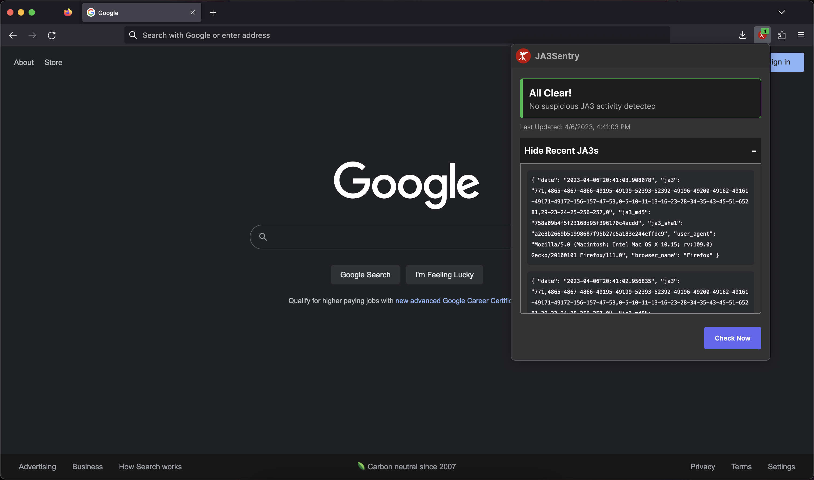
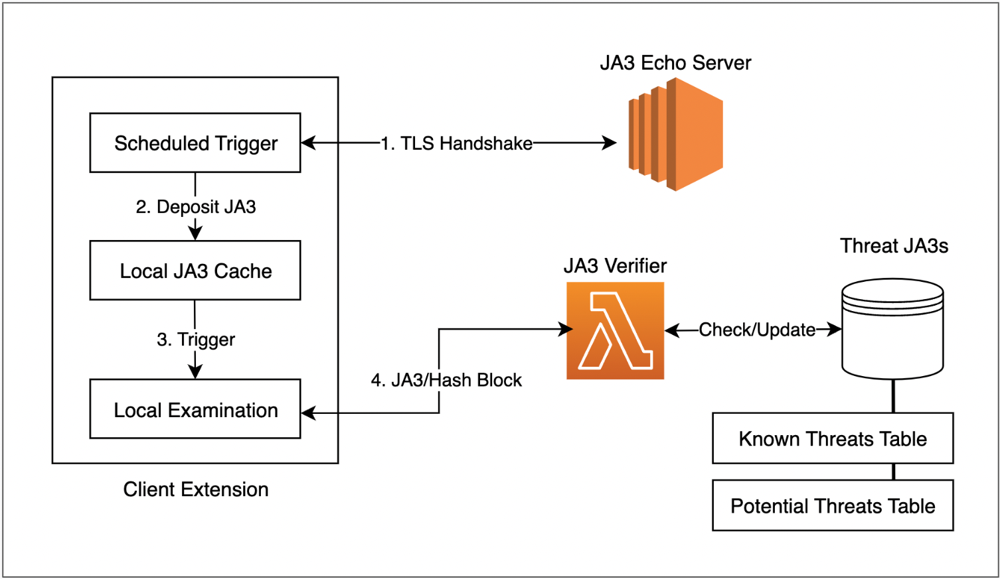

# JA3Sentry

A browser extension for identifying signs of malicious activity through client TLS fingerprinting.

## Architecture

- Echo Server: AWS EC2 socket server that mirrors TLS Client Hello handshake packet data back to the client, including calculated client JA3.
- Extension: Client side Firefox extension which repeatedly contacts the Echo Server to get updated JA3s for the client. It then assesses the risk of the received JA3 and checks the JA3 against a database of known threats
- Verifier Lambda: A serverless REST API that serves two endpoints:
  - Check a collection of JA3s against a database of _known threat_ JA3 hashes
  - Add a JA3 to a database table of _potentially_ risky client signatures
